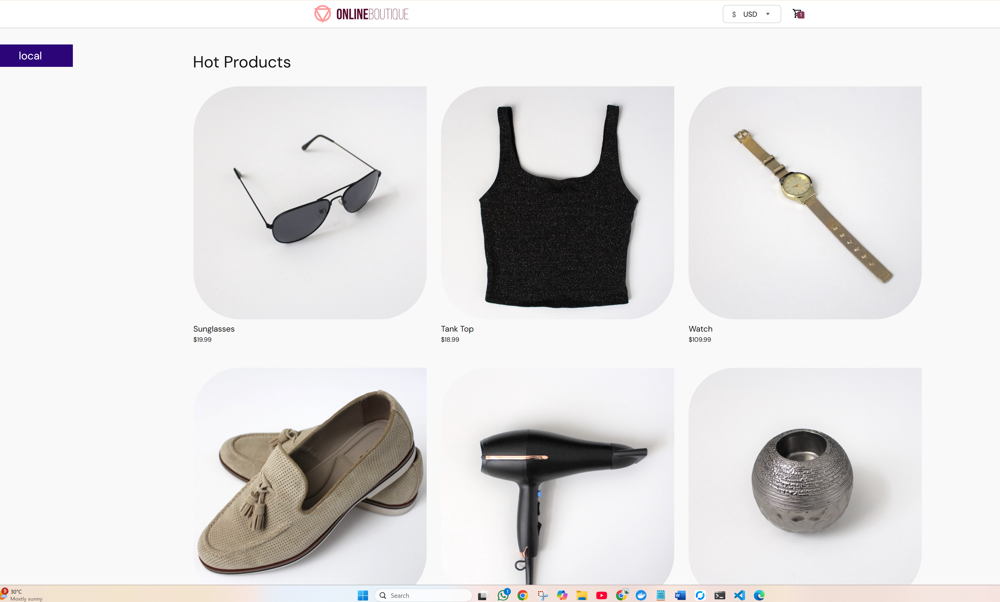
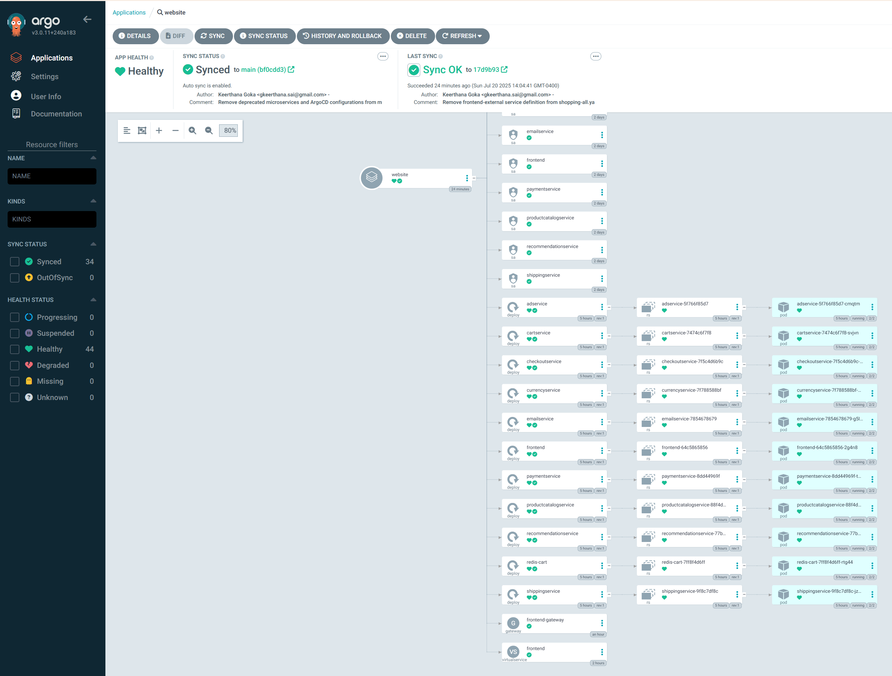
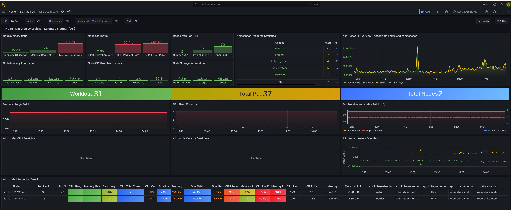


# EKS Shopping Platform with Microservices, Observability & Service Mesh

This repository provisions a robust AWS EKS infrastructure and deploys a production-like shopping application with 11 microservices. The platform includes:

- A secure, highly-available **EKS cluster** with managed node groups
- Networking resources (VPC, subnets, security groups) configured for best practices
- Cluster autoscaling with **Karpenter**
- Istio **service mesh** for traffic management and observability
- Centralized monitoring with **Prometheus & Grafana**
- **GitOps workflow** with Argo CD for continuous delivery

All infrastructure components are automated using **Terraform**, enabling reproducible and scalable deployments.

This setup provides a complete Kubernetes platform for running microservices with end-to-end observability, security, and CI/CD capabilities.

## EKS Platform Deployment Guide

### Prerequisites

- **Terraform** >= 1.3.0  
- **kubectl**  
- **helm**  
- **AWS CLI** (with credentials configured)  

---

## Getting Started

### Clone the Repository

```bash
git clone https://github.com/KeerthanaGoka/aws-eks.git
cd aws-eks/terraform
```

### Provision AWS Infrastructure

```bash
cd terraform
terraform init
terraform apply
kubectl rollout restart deployment istio-ingress -n istio-ingress
kubectl apply -f manifests/karpenter.yaml
```
### Terraform Deployment Summary

From the main.tf file, the following components were provisioned:

-VPC with public and private subnets across 3 Availability Zones

-EKS Cluster (v1.30) with managed node group for Karpenter using Bottlerocket OS

-Karpenter autoscaler for provisioning dynamic compute resources

-Istio Ingress Gateway, Istiod, and base Helm charts deployed via Blueprints module

-Argo CD GitOps controller

-Helm releases for kube-state-metrics and karpenter

-Network configurations to allow Istio webhook ports (15012 and 15017)

-IAM roles and security groups configured for Karpenter and EKS services

-All provisioning is modular, repeatable, and adheres to AWS best practices for production workloads.


### Istio sidecar injection

```bash
kubectl label namespace default istio-injection=enabled
```

### Observability Addons - Prometheus & Grafana

```bash
for ADDON in prometheus grafana
do
    ADDON_URL="https://raw.githubusercontent.com/istio/istio/release-1.20/samples/addons/$ADDON.yaml"
    kubectl apply --server-side -f $ADDON_URL
done
```

### Deploy Argo CD

```bash
helm repo add argo https://argoproj.github.io/argo-helm
helm repo update
helm install argocd argo/argo-cd -n argocd --create-namespace

```

### Deploy Your Website

```bash
kubectl apply -f manifests/argocd/shopping-application.yaml # Creates ArgoCD Application
kubectl apply -f manifests/shopping/frontendvs.yaml
```
Verify Istio Gateway and VirtualService are correctly configured to route external traffic to frontend service.


---

## Observability Dashboards

## ArgoCD (GitOps Dashboard)

Apps will automatically sync via Argo CD from the main branch.
You can monitor health/status from the Argo CD UI.

```bash
kubectl port-forward svc/argocd-server -n argocd 8080:443
kubectl get secret argocd-initial-admin-secret -n argocd -o jsonpath="{.data.password}" | base64 -d # for password
```
Access ArgoCD at: [http://localhost:8080](http://localhost:8080)



### Grafana (Metrics Dashboard)

```bash
kubectl -n monitoring port-forward svc/prometheus-grafana 3000:80
```

Access Grafana at: [http://localhost:3000](http://localhost:3000)


---

## Contributing

Contributions are welcome! Feel free to open issues or submit pull requests to improve this project.

---

## License

This project is licensed under the **MIT License**.

---

## Author

**Keerthana Goka**  
[GitHub Profile](https://github.com/KeerthanaGoka)
